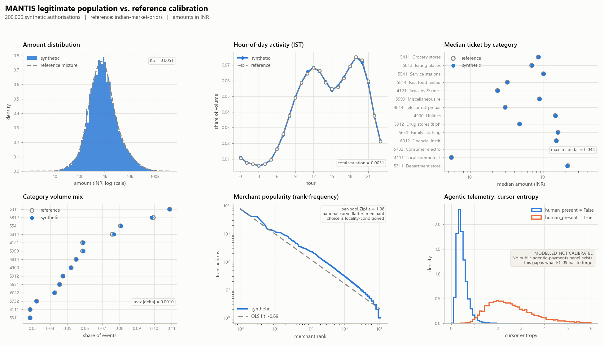

# The legitimate population

> `python -m mantis.foundry.base --n 200000 --seed 7`
> → `data/generated/population.parquet` + `population.manifest.json` + `docs/population_calibration.png`

Pillar 2 begins with the background, not the attacks. A fraud model trained
against a lazy background learns to separate "attack" from "obviously
synthetic", scores 0.99, and proves nothing. Everything the Mandate Firewall
later claims rests on this population being hard to hide in.



---

## Where the numbers come from

Two provenances, and the run always says which one it used.

| | Source | When |
|---|---|---|
| **Priors** (default) | `mantis/foundry/base/reference.py` — Indian-market practitioner estimates | Clean clone, no Kaggle token |
| **Fitted** | `data/reference/reference_stats.json`, written by `scripts/fit_reference.py` | Someone dropped the Sparkov CSVs into `data/reference/` |

**The honest version of the calibration claim.** The priors reproduce the
*published aggregates* of the Indian card and UPI market — UPI P2M average
ticket in the high hundreds, card POS in the low thousands, card-not-present
higher again, an evening-peak diurnal curve. They are not fitted to a licensed
transaction panel, and `ReferenceStats.provenance` says so in machine-readable
form so the fidelity scorecard can print it without anyone remembering to.

`scripts/fit_reference.py` exists so that claim can be upgraded. It is
deliberately selective about what it will fit:

- **Fits** (these transfer): hour-of-day curve, day-of-week curve, per-category
  log-amount **sigma**, merchant Zipf exponent, per-customer velocity, session
  burst rate.
- **Refuses to fit** (these do not): MCC volume mix, amount *location*,
  geography, BINs, 3DS outcomes, channel mix. Sparkov is US data and is itself
  synthetic; fitting the Indian category mix from it would be strictly worse
  than the prior.

Amount location is available behind `--fit-amount-location` and warns when used,
because converting US ticket sizes to Indian ones needs PPP and basket
composition, not a spot FX rate. Only `is_fraud == 0` rows are ever used.

---

## The model

A draw is causal, and each step conditions on the last:

```
customer -> mcc -> agentic? -> channel -> city -> merchant -> amount
         -> entry mode -> 3DS -> credential -> device -> geo -> timestamp
```

**Entities are built once** and held fixed for the window (`entities.py`). A
customer keeps one to three cards, one to three devices, a home point, a CGNAT
`/24`, a gamma-drawn daily rate and a set of habitual browsing domains. Without
that stability, `device_novelty_for_customer` and `geo_distance_from_home_km`
would be noise rather than features.

**Amounts** are per-MCC log-normal — 26 categories, each with its own median and
sigma — because one global curve that produces a fuel purchase and a flight
booking from the same distribution is the single most obvious synthetic tell. A
share of amounts snap to round rupee values, more often on fuel, recharges and
P2P.

**Merchants** are Zipf by global rank, sampled conditional on category *and*
metro, with per-customer stable favourites. Customers are loyal and local.

**Timestamps** are IST, drawn from the diurnal and day-of-week curves, with a
share pulled into short session bursts — real cardholders buy coffee and then a
newspaper four minutes later, and without that the velocity features have no
upper tail to learn from.

**Missingness is modelled.** Card-present rows carry a terminal and no device or
IP; remote rows carry a device and an IP and no terminal; about a fifth of
card-not-present rows reach the issuer with no usable geo at all.

---

## The agentic 15%

Agent adoption is **concentrated, not spread thin**: ~30% of customers use an
agent, and those customers route a large share of eligible spend through it.
Which events qualify is weighted by category affinity — flights and
subscriptions high, fuel near zero, because an agent cannot fill a tank. The
overall MCC mix is unchanged by this, because adoption *relabels* events rather
than redrawing them.

Every legitimate agentic event carries a coherent mandate: the purchased
category is inside the scope, the amount is under the ceiling, the mandate is
unexpired, cart and payment mandates name the merchant they paid, and the
provenance chain is 2–6 benign URLs from the customer's habitual set ending at
the merchant's own domain.

### Four choices that exist to keep the detector honest

1. **Not every legitimate agent is KYA-registered** (~2.8% are not), and a
   smaller tail has a consent signature that does not verify (~0.3%). If those
   flags were clean separators, L0 would post perfect recall against a generator
   artefact, and the first judge to ask about false positives on registered
   agents would find nothing behind it.
2. **Human-present sessions carry genuinely human telemetry.** Cursor entropy
   and dwell time rise materially when a human is really watching. Without that
   gap, F1-09 (human-present spoofing) would have nothing to forge.
3. **Legitimate spend approaches the ceiling** — the median `amount / scope_max`
   is ~0.65 and the tail reaches 0.99. A detector cannot pass by flagging "spent
   close to the limit".
4. **Merchant choice is loyal and local**, so `merchant_novelty_for_customer`
   has a believable baseline instead of firing on every second transaction.

The cursor-entropy panel of the figure is labelled **MODELLED, NOT CALIBRATED**,
because no public agentic-payments panel exists to calibrate against.
Manufacturing that data is the entire project; pretending it was measured would
be the one claim that could sink the room.

---

## Calibration at the gate

200,000 events, seed 7, priors:

| Metric | Value |
|---|---|
| Amount KS vs reference mixture | **0.0051** |
| Hour-of-day total variation | **0.0066** |
| MCC mix, max abs delta | **0.0010** |
| Per-MCC median, max abs rel delta | **0.044** |
| Merchant Zipf, realised / per-pool | 0.89 / 1.08 |
| Agentic share | 15.00% |
| Runtime | ~8 s, 15.3 MB parquet |

Two of these are non-zero **by design** and worth saying out loud rather than
tuning away:

- **The amount KS is not zero** because round-number snapping deliberately moves
  mass onto multiples of 50/100/500. KS charges us for it. A small non-zero
  distance with a known cause is worth more than a zero.
- **The national Zipf curve is flatter than the per-pool exponent** because
  merchant choice is locality-conditioned: a small grocer in Guwahati holds real
  share of Guwahati volume however tiny it is nationally. That is the locality
  model working, not a calibration miss, and the figure plots the realised OLS
  fit rather than the sampling exponent so the panel does not misrepresent it.

Every event is constructed through `TxEvent`, so the population provably
satisfies the frozen schema — rail-consistency and label-integrity validators
included — rather than merely resembling it. Every row is `is_fraud=False`:
this module produces the background only.
